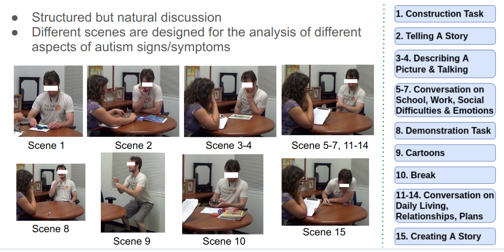

# Discriminative Few Shot Learning of Facial Dynamics in Interview Videos for Autism Trait Classification
This is the implementation of paper 'Zhang, Na, et al. "Discriminative few shot learning of facial dynamics in interview videos for autism trait classification." IEEE Transactions on Affective Computing (2022).'.

# Introduction

Autism Spectrum Disorder (ASD) is a prevalent neurodevelopmental disorder characterized by impairments in social and communicative behaviors. It affects people’s communication and behavior.

The signs and symptoms can be in various aspects, such as eye contact, Hand movements, Speech traits, and so on.

Possible connections between autism and facial expression recognition have recently been studied in the literature. 

Research shows that Individuals with ASD often have difficulty interpreting and regulating their own emotions.

In this work, we developed a discriminative few shot learning method to analyze hour-long ADOS video data and exploring the fusion of facial dynamics for the trait classification of ASD by leveraging well-established computer vision tools from 3D spatio-temporal dynamic texture feature (LPQ-TOP) extraction, sparse coding (K-SVD) and marginal fisher analysis (MFA) to few-shot learning (FSL) and scene-level fusion.

we have constructed a three-category system to classify an individual with Autism into three different severity levels, i.e. Autism, Autism Spectrum, and Non-Spectrum.

### Link: 
[[PDF]](https://ieeexplore.ieee.org/abstract/document/9785700)

# Data

ADOS means Autism Diagnostic Observation Schedule.

It is a structured but natural discussion between the highly trained interviewer and participant.

The schedule contains 15 standardized activities:

(1) Construction task: The participant is asked to use puzzle pieces to complete a diagram and is instructed to request more pieces when needed.

(2) Telling a story from a book: The book has very few words; The participant is asked to interpret the story from the visual cues, including reading emotions on the faces of the people in the story.

(3) Description of a Picture: A picture is shown. The participant is asked to describe this picture. The picture provides opportunities for interaction with the interviewer.

(4) Conversation and Reporting: Based largely on the picture the participant saw in (3), the participant is asked to talk more. Scenes 5-7 focus more on conversation. Scene 5 talks about work or school lives of the participant. Scene 6 talks about Social Difficulties and Annoyance of the participant. Scene 7 talks about the events/objects that elicit different emotions in the participant and asks the participant to describe their feelings.

(8) Demonstration Task: The participant is asked to show and tell the interviewer how to do a typical procedure, such as brushing their teeth.

In scene (9) Cartoons, First, a series of cards showing cartoon characters are presented to the participant. These cards tell a story. Then the participant stands to re-tell the story. Their use of the gestures, emotions, and reference to relationships is evaluated finally.

In scene (10) Break, The participant is given a few items (like magazines, toys, color pens and papers); And the interviewer observes their behavior during this free time.

Scene 11 to 14 mainly focus more on conversation. (11) Daily Living: Scene 11 talks about their current living situation. (12) Friends, Relationships, and Marriage. (13) Loneliness. (14) Plans and Hopes.

(15) Creating a Story: The participant is asked to use their imagination to create a novel story using some objects.

For each activity, the interviewer gives the question, and the participants gives their response. The response of participants to each activity is inspected by the interviewers. Different scenes are designed for the analysis of different aspects of autism. This schedule can capture various information, like: Hand gesture, Face emotions, Body behavior, Speech traits, gaze, etc.

# pipeline

Our method focuses on the analysis of facial dynamics features, such as facial appearance, expression changes. The framework contains 4 parts:

* Facial feature extraction

* Feature Representation learning

* Few-shot learning

* Classification 

First, face frames are extracted from the video by detection and cropping. Second, spatial-temporal facial feature is extracted from each 2-second long frames subvolume. Third, Sparse coding and dimension reduction is used to learn a discriminative feature. Last, the final representation is fed to a few-shot learning module for classification.

# Content
This repository contains the implementation of:
* video pre-processing
* spatio-temporal feature extraction
* sparse coding
* marginal fisher analysis
* few-shot learning

